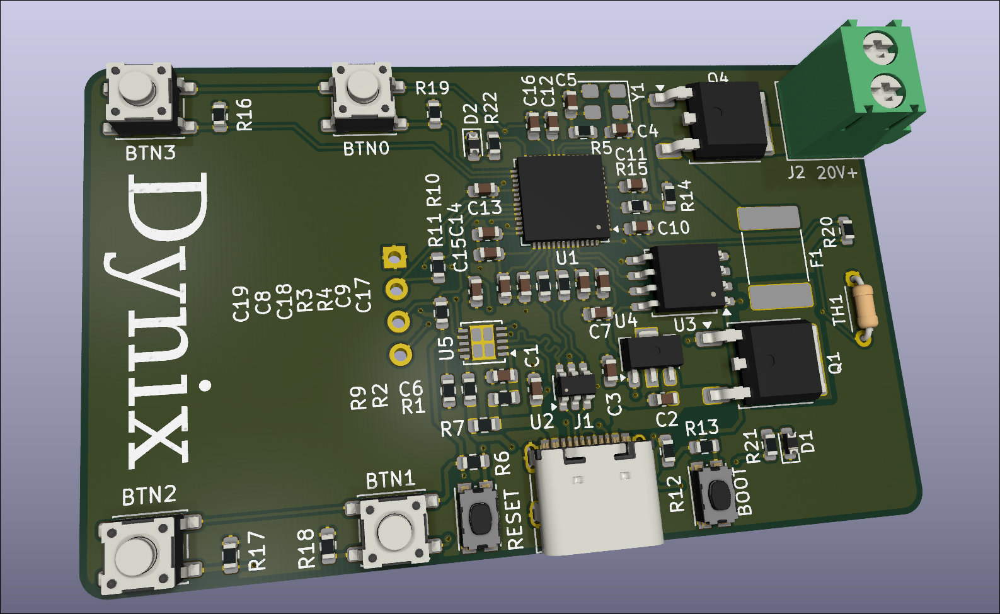
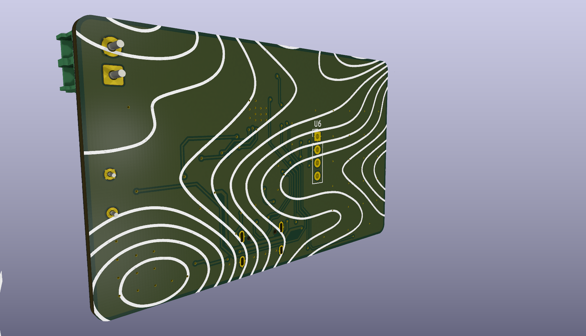
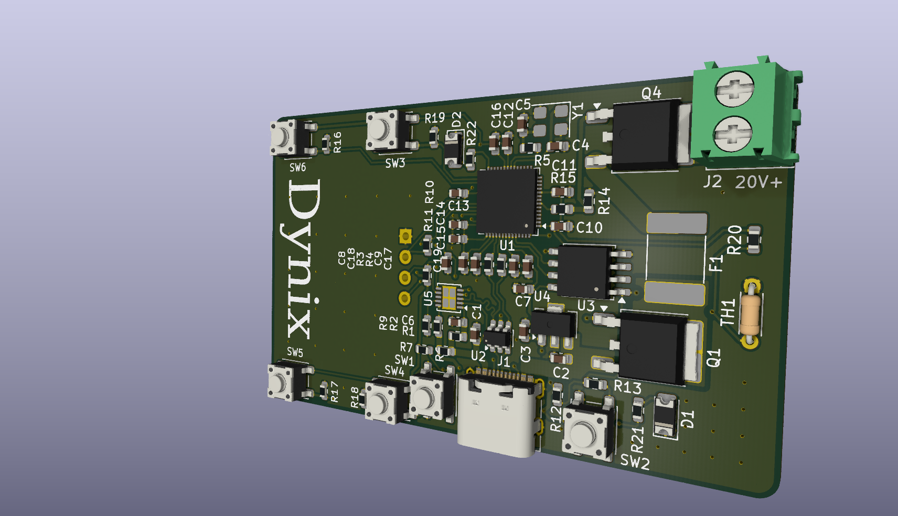
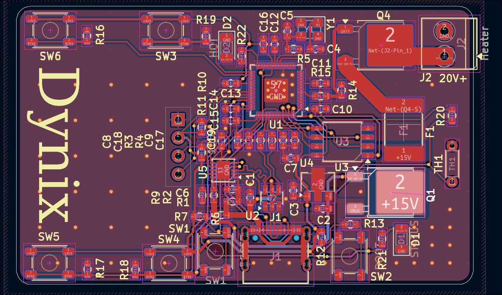

# HotPlate
This is a design for an solder reflow hotplate controlled by an RP2040.

# Why I Made It
I made this PCB since I plan to solder more components in the future. But I currently only have an solder iron which is too big for smaller SMD components, so I can use this to easily solder those smaller components.

# Picture

|Name                      |Purpose                  |Quantity|Total Cost (USD)|Link                                                     |Distributor|
|--------------------------|-------------------------|--------|----------------|---------------------------------------------------------|-----------|
|70mm round Polymide Heater|Heating Element          |1       |3.92            |https://www.aliexpress.us/item/2255801077213882.html?mp=1|Aliexpress |
|PCB Stencil               |For Manual PCB Assembly  |1       |7.11            |                                                         |JLCPCB     |
|PCB                       |PCB for Build            |5       |5.10            |                                                         |JLCPCB     |
|100n Capacitor            |Capacitor                |100     |0.23            |https://www.lcsc.com/product-detail/C6119867.html        |LCSC       |
|1uF Capacitor             |Capacitor                |50      |0.27            |https://www.lcsc.com/product-detail/C59782.html          |LCSC       |
|10uF Capacitor            |Capacitor                |50      |0.40            |https://www.lcsc.com/product-detail/C19702.html          |LCSC       |
|12pF Capacitor            |Crystal Load Capacitors  |100     |0.28            |https://www.lcsc.com/product-detail/C45359931.html       |LCSC       |
|10k Resistor              |Resistor                 |100     |0.10            |https://www.lcsc.com/product-detail/C2930027.html        |LCSC       |
|1k Resistor               |Resistor                 |100     |0.09            |https://www.lcsc.com/product-detail/C2907113.html        |LCSC       |
|5.1k Resistor             |Resistor                 |100     |0.10            |https://www.lcsc.com/product-detail/C2907114.html        |LCSC       |
|27 Resistor               |Resistor                 |100     |0.10            |https://www.lcsc.com/product-detail/C2907021.html        |LCSC       |
|2.7k Resistor             |Resistor                 |100     |0.15            |https://www.lcsc.com/product-detail/C13167.html          |LCSC       |
|10 Resistor               |Resistor                 |20      |0.04            |https://www.lcsc.com/product-detail/C22859.html          |LCSC       |
|49.9 Resistor             |Resistor                 |100     |0.11            |https://www.lcsc.com/product-detail/C2930110.html        |LCSC       |
|22.6k Resistor            |REsistor                 |100     |0.12            |https://www.lcsc.com/product-detail/C2999509.html        |LCSC       |
|LED                       |Indicator LEDs           |50      |0.40            |https://www.lcsc.com/product-detail/C2827254.html        |LCSC       |
|100Ohm Resistor           |Resistor                 |100     |0.10            |https://www.lcsc.com/product-detail/C2906981.html        |LCSC       |
|Push Button               |Reset, Boot, Menu Buttons|20      |0.34            |https://www.lcsc.com/product-detail/C18078070.html       |LCSC       |
|SX3B12.000F1210F30 Crystal|Clock for RP2040         |5       |0.36            |https://www.lcsc.com/product-detail/C2901650.html        |LCSC       |
|LUTE 2920L500/30GR Fuse   |Prevents Overheating     |5       |0.74            |https://www.lcsc.com/product-detail/C19078763.html       |LCSC       |
|L78L33ACUTR               |Voltage Regulator        |5       |0.49            |https://www.lcsc.com/product-detail/C22358668.html       |LCSC       |
|USBLC6-2SC6               |Power Protection         |5       |0.77            |https://www.lcsc.com/product-detail/C7519.html           |LCSC       |
|RP2040                    |Microcontroller          |1       |0.95            |https://www.lcsc.com/product-detail/C2040.html           |LCSC       |
|HUSB238 USB PD Chip       | USB Power Delivery      |1       |0.50            |https://www.lcsc.com/product-detail/C7471904.html        |LCSC       |
|W25Q32JVSSIQ Flash Chip   |Storage of Program       |5       |7.51            |https://www.lcsc.com/product-detail/C179173.html         |LCSC       |
|N-Channel MOSFET          |Power Control            |5       |0.58            |https://www.lcsc.com/product-detail/C2902884.html        |LCSC       |
|P-Channel MOSFET          |Control Power            |1       |0.34            |https://www.lcsc.com/product-detail/C5277951.html        |LCSC       |
|2 Pin Terminal Block      |To Power Heating Element |5       |0.42            |https://www.lcsc.com/product-detail/C695629.html         |LCSC       |
|USB-C Receptacle          |Power                    |5       |0.41            |https://www.lcsc.com/product-detail/C2988369.html        |LCSC       |
|NTC Thermistor 100kΩ      |Thermometer              |5       |1.28            |https://www.lcsc.com/product-detail/C5355638.html        |LCSC       |
